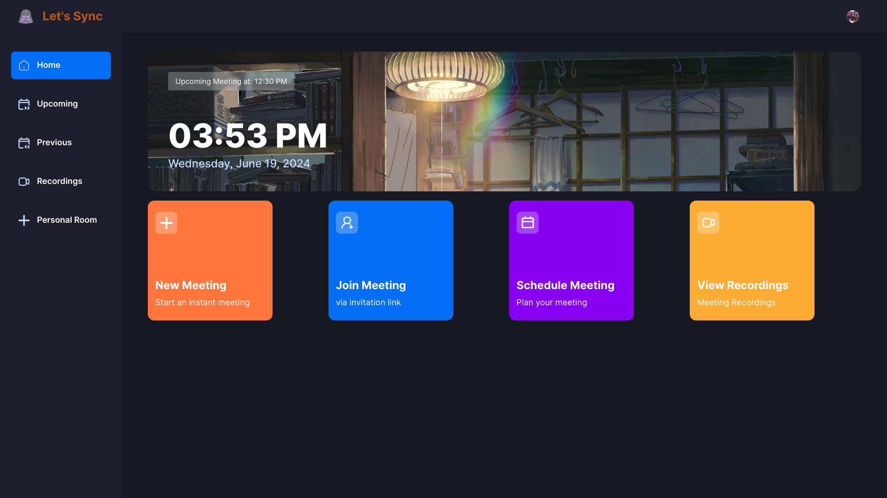
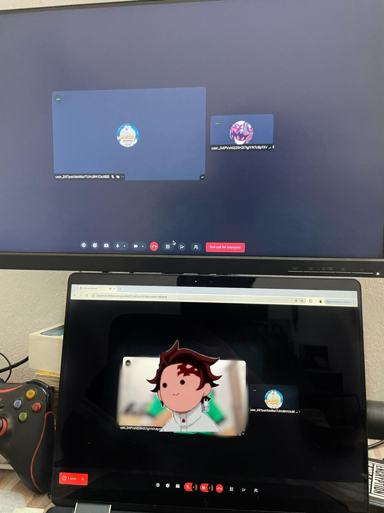

# SyncedStream

SyncedStream is a powerful web application built with Next.js 14 for seamless video conferencing. Leveraging the robust Stream video SDK, SyncedStream allows users to set up and join video meetings effortlessly. The app ui components are made using Shadcn and it is styled with Tailwind CSS, ensuring a modern and responsive design, and uses Clerk for secure user authentication.

## Features

- **User Authentication with Clerk**: Secure and easy-to-use authentication system.
- **Create, Record and Join Video Meetings**: Host or join video meetings with just a few clicks.
- **Real-Time Video Streaming**: High-quality video streaming powered by Stream video SDK.
- **Modern Styling with Tailwind CSS**: A sleek, responsive design that looks great on all devices.
- **TypeScript**: Enhanced type safety and code maintainability.

## Getting Started

To get started with SyncedStream, follow these steps:

### Prerequisites

Ensure you have the following installed on your local development environment:

- Node.js (v14.x or higher)
- npm (v6.x or higher) or yarn (v1.22.x or higher)

### Installation

1. **Clone the repository**:

    ```bash
    git clone https://github.com/Darth-InVader15/syncedstream.git
    cd syncedstream
    ```

2. **Install dependencies**:

    ```bash
    npm install
    # or
    yarn install
    ```

### Running the Application

1. **Start the development server**:

    ```bash
    npm run dev
    # or
    yarn dev
    ```

2. **Open the application in your browser**:

    Navigate to [http://localhost:3000](http://localhost:3000) to see SyncedStream in action.

## Configuration

### Environment Variables

To configure SyncedStream, you will need to set up the following environment variables. Create a `.env.local` file in the root of your project and add your configuration details:

```env
NEXT_PUBLIC_CLERK_PUBLISHABLE_KEY=<your clerk api key>
CLERK_SECRET_KEY=<your clerk key>
NEXT_PUBLIC_CLERK_SIGN_IN_URL=/sign-in
NEXT_PUBLIC_CLERK_SIGN_UP_URL=/sign-up
NEXT_PUBLIC_STREAM_API_KEY=<your stream api key>
STREAM_SECRET_KEY=<your stream secret key>
```

## Screenshots


